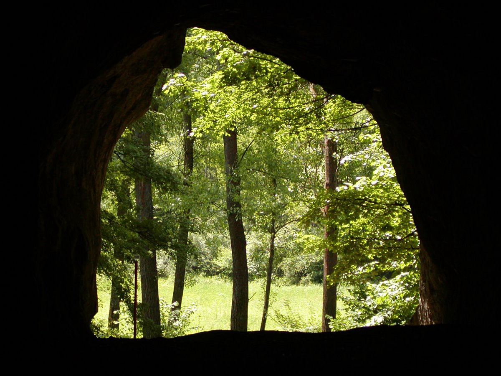

Wow, it has been a month since I posted last. Alot of cool stuff has been happening and I haven’t had time to update over here. Once we hit React.js, things ramped up quickly. I almost immediately loved React’s way of offering dynamic views, especially over the Backbone/Handlebars way we had been using before. Besides learning React, the last three weeks of the Iron Yard are when we have our chance for a large scale app build, no more lectures, just lab time.

Heading in to those last three weeks, I imagined I would have more than enough time on my hands and that things would settle down, but boy was I wrong. I ended up crawling in to the coding cave and not coming out until a few days ago.

Before that though, here is the coolest project I did since my last update, but before final project. It’s an online ordering system for a Thai restaurant. It also includes a backend interface for the restaurant to pull down new orders and process them.

[**Sukho Thai**  
_Edit description_graysonhicks.github.io](http://graysonhicks.github.io/tiy-7.3-majestic-thai/ "http://graysonhicks.github.io/tiy-7.3-majestic-thai/")

Besides that, most of our daily projects were getting acquainted with the ins and outs of React, but also several backend options like Parse and Firebase.

As for my final project, I am very proud of it. It is a web app that allows you to search for city parks in a consistent, functional, and visually appealing way. You can toggle between a grid and map view, as well as sort and filter your results by a number of parameters. Check it out:

[**Parkary**  
](http://parkary.com "http://parkary.com")search for city parks in a consistent, functional, and visually appealing way[parkary.com](http://parkary.com "http://parkary.com")

Now that the Iron Yard class is over, I am actively looking for front end web jobs here in Greenville and the surrounding area. Until then, I am still coming in to the Iron Yard everyday to work on side projects and continue learning React / Parse / whatever else comes my way.

By the way, here is my finished personal / portfolio site as well:

[**Grayson Hicks | 2016**  
_I have always loved computers, and always been creative. Beginning in 2015, I set out to make the two a career, so I…_graysonhicks.com](http://graysonhicks.com "http://graysonhicks.com")

Until next time!