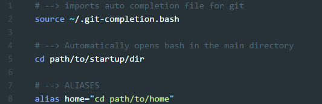
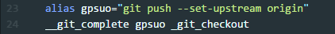
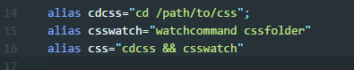

You would think that after programming professionally for a while, one would only get excited by writing paradigm-shifting frameworks, mining cryptocurrencies, or fine tuning machine learning algorithms. While those are things I would like to work on when I can, they’re not my day to day. My day to day is probably the same as 95% of other web devs day to day. I’ve got my stack and my punchlist, now I need to make it happen efficiently. Instead of getting excited about frameworks, I find myself often thrilled by a new… snippet or alias. It’s the little things in life, right?

#### The $5000 Bike and Poor Fitting Shoes

Imagine you are a person who is meant to ride a bike everyday as efficiently as possible. You spend hours tuning it up, upgrading it, arguing on Twitter with other bike riders about which bike frame is better. Everyday you wake up, put on your shoes and ride your fancy bike as best you can. Imagine now that the shoes you put on every morning to ride are lace-ups and fit just a little too tight. At some point during the day, sometimes every morning, they bother you or slow you down just a bit. You upgrade the pedals, the seat, the wheels, etc. and are riding on a very, very fine bike, but there are still some low-hanging processes of your everyday routine that can by simplified and improved. Better fitting, velcro shoes may only save you a minute or so every morning, bring the pain down a few notches after a long day’s ride, but it adds up. This is basically how I imagine snippets and aliases in the life of a developer. I hope some of what I share can lead to better shoes for you, I know it’s helped me.

### Are they cool?

I know what you’re saying: “Aliases and snippets?” So they are functional, but are they cool? Yes! Our company has a pretty well established stack. We certainly bring in new stuff for certain features or explore as we continue to grow, but for the most part we are immune to most of the JS framework wars. One tool that recently caught my attention is [prettier](https://github.com/prettier/prettier). Kind of like a linter (but [not](https://github.com/prettier/prettier#how-does-it-compare-to-eslint-or-tslint-stylelint)), it is build around the idea that we waste a lot of time tabbing, spacing, entering and semi-coloning, when we could spend that time coding. I personally use the [atom plugin](https://github.com/prettier/prettier-atom) with the format on save, to really speed things up.

All of that to say, yes, pretty much anything that increases your productivity without sacrificing the quality of your work is cool.

And if you like time savers like aliases and snippets, I recommend [this](https://www.viget.com/articles/my-overused-sublime-text-keyboard-shortcuts) post by Tommy Marshall about keyboard shortcuts within the editor as well.

So, here are a couple of my favorite snippets and aliases (keep in mind I use atom and bash) to keep my days fun and productive:

### **Bash**

#### Aliases

Since there are no aliases without a command line tool, I’ll start here. My first alias? `aliases`. Not kidding. I kept forgetting which bash file to edit (it depends on your setup), so I just saved it. Underneath is just:

`alias aliases="atom [path/to/aliasesfile]”`

Note that I’m using atom to open because some aliases are complex and I like the formatting to see more clearly, but you could just as easily use your own text-editor:

Windows:

`alias aliases=”start notepad [path/to/aliasesfile”`

Mac:

`alias aliases=”open -e [path/to/aliasesfile]”`

With that set, adding and editing these in the future will be a breeze.

#### Starting Folder

Navigating to our main code base (either through: 1. file system, right-click, bash here, or 2. `cd cd cd`) was annoying for the root I work in 99% of the time. I did (and still do) have a `cd` aliases for getting to that root, but wanted bash to just open there like a homepage. You can do that by putting a `cd` command at the top of where keep your aliases, like this:

NOTE: This is helpful most of the time, but can also be annoying when opening a bash window in a different folder by right-clicking bash here. That’s because this `cd` will still run. If you operate in the same handful of folders, like me, I generally just use other `cd` aliases to get around and avoid that. This one helps speed up every morning more than it ever slows me down.

#### Chrome

A normal day is generally opening bash and firing off a couple commands to get everything up and going. While this next command for multiple startup homepages [can be set up in Chrome itself](http://www.ihaveapc.com/2012/08/how-to-set-multiple-home-pages-in-google-chrome/), I prefer to just keep it as an alias instead of clicking away from the terminal.

Windows:

`alias chrome=”start chrome ‘page1.com’ ‘page2.com’ ‘localhost’”`

Mac:

`alias chrome=”open -a "Google Chrome" page1.com page2.com localhost”`

#### Git

These are probably my favorite, because when you really get them cooking, you can feel the time being saved and productivity going up. The area of git aliases is not new and there have been some folks put lots of time and effort in to this, just [explore here](https://www.google.com/search?q=git+aliases).

For the most part I just use the alias conventions found [here](https://github.com/robbyrussell/oh-my-zsh/wiki/Cheatsheet#git), but these are in zsh (which I recommend if you like this kind of stuff). For my work station, we use Git Bash which, despite the name, acts up a bit with aliasing. For example, when I create a branch with `gcb` I will quickly want to set my upstream branch, and for efficiency’s sake tab to autocomplete my current branch. Git bash loses the ability to tab autocomplete, so that required using [git-completion.bash](https://github.com/git/git/blob/master/contrib/completion/git-completion.bash). Just `source` it at the top of your bash file like this:

Then to use this for basically any git aliases autocomplete you follow this formula:

`__git_complete` calls the function for autocompletion inside `.git-completion.bash`

`gpsuo` In this case, I’m inserting the alias that I am using, but this is where you will pass in whatever alias you are wanting to setup.

`_git_checkout` Here is the git function that you want bash to use for autocomplete, and it differs by which command you are using.

For example, note here we are passing in `_git_push` because those are the autocomplete options we want to show when using the `gp` alias.

I use git aliases more than any others, as our workflow calls for lots of branches, commits, merges, etc. so these aliases save lots of time. I would recommend zsh due to its out of the box handling of autocomplete, but the bash fix above works for me.

#### Random

Of course, if I am spending as much time and energy with program specific aliases, I’ve got a few random ones that are helpful from time to time. I view aliases like functions, so I will try to namespace them and stick to simple ones, with maybe a larger one that calls several simple ones. For example, I hate `cd`'ing down into my styles folder to start a watch on it, so I’ve got:

I’ve got the same setup for running tests.

Caveat: I realize that alot of these are already included if you are using something like [create-react-app](https://github.com/facebookincubator/create-react-app), but I think it is important to have an understanding of what is going on [under the hood](https://github.com/facebookincubator/create-react-app/blob/master/package.json), or be prepared for similar behavior if you have a project without such a robust package.json prepared for you.

#### Conclusion

There are loads more way that developers use aliases in their day to day. Hopefully something in here is as helpful as better fitting shoes for a cyclist, or convinces you to take a couple commonly used commands, code them up into an alias, and make your daily ride a little more comfortable.

If you’ve got any cool aliases or questions about them, let me know!

#### [Part 2 will cover some snippets for bringing the exact same mentality from the command line, in to the editor.](https://medium.com/@graysonhicks/aliases-and-snippets-pt-2-snippets-bc8ce1ab183f)
