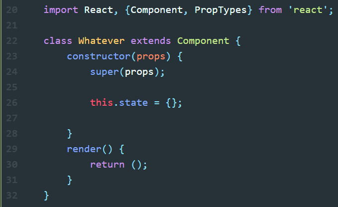
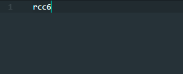
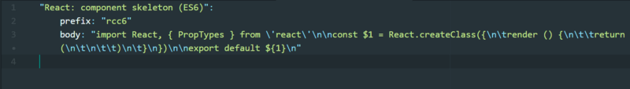
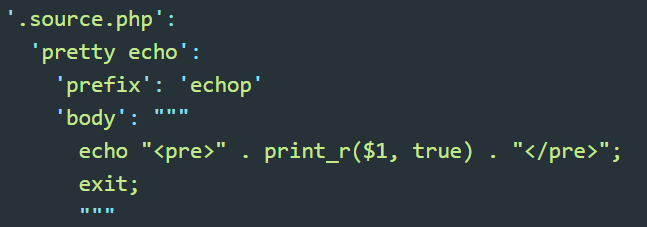
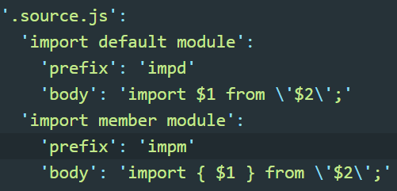
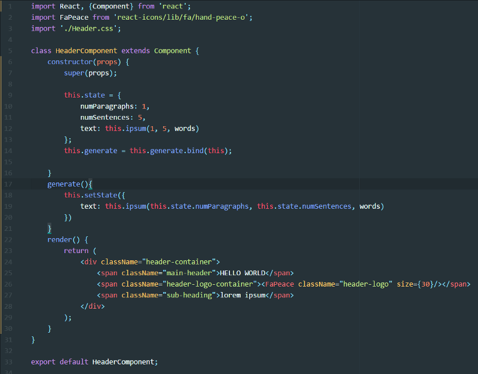

If you read my [previous post about aliases](https://medium.com/@graysonhicks/aliases-and-snippets-pt-1-aliases-fffffc16ba75), then you’ll remember the analogy of aliases and snippets being akin to a small part of the high dollar setup of a finely tuned bicycle. (If you haven’t, I recommend doing so first to get the gist first.) Not leveraging them is like spending $5000 on a high performance bike, but failing to upgrade your old ill-fitting shoes, which in turn hold you back and slow you down.

To continue this metaphor, I think of aliases as extremely useful outside the code editor, in the terminal, being used to setup projects and accomplish lots of your daily tasks and build tools quickly. From npm to bash, there are no shortage of great shortcuts you can find.

Snippets, on the other hand, are used within the code editor. Most people are familiar with snippets, as several editors like Sublime and Atom offer a number of packages of them, but some people never expand on these to match their daily routine or stack.

If you like time savers like aliases and snippets, I recommend [this](https://www.viget.com/articles/my-overused-sublime-text-keyboard-shortcuts) post by Tommy Marshall about keyboard shortcuts within the editor as well.

[I’ve already answered whether aliases and snippets are considered ‘cool’.](https://medium.com/@graysonhicks/aliases-and-snippets-pt-1-aliases-fffffc16ba75/#aa5a) (They are). I believe it is more than worth the time to do so. Here are a couple of key benefits:

1.  Save time
2.  Eliminate linting errors
3.  Consistent formatting
4.  A focus on writing quality code

### 1\. Save Time

This is the most obvious benefit of a snippet, and I’ll share one that is a real time saver. Anyone that uses React and Atom should check out some common React.js snippets used in Atom, either with: [atom-react](https://github.com/orktes/atom-react) or [atom-react-snippets](https://github.com/webbushka/atom-react-snippets). They use slightly different bindings and outputs, but the example I’ll use from atom-react-snippets is basic and really fits either one.

Create lots of React components and sick of typing this:

The binding for creating this is just:

Plus the tab key and voila, the component shown above will auto expand, ready to go!

The snippet under the hood (in Atom) looks like this:

For a declarative library like React, think of this as another layer of declarations! In my actual day-to-day, we use a handrolled JS framework, so there are no third party snippet packages, so I created my own snippet to build the skeleton of a new JS file with all of the markup I need. This saves me from copy and pasting from an existing file that may bring along other bits of unneeded code that is deleted, sometimes causing errors.

Here’s two other snippets that save me a good amount of time:

#### PHP Pretty Echo

If you are like me, a JS dev who is used to `console.log` constantly being used for debugging, the move to debugging in PHP was a little rough. The above snippet of `echop` will work in a similar fashion, printing either in the network console or on the screen, and stop the script at that point.

#### JS Imports

I love the `import` feature of JS for bringing the best of amazing libraries to my projects, but I hate constantly typing the imports, especially if it’s using named member modules.

The two snippets of `impd` and `impm` allow you to quickly import whole default modules or named member modules into your project quickly.

### 2\. Eliminate Linting Errors

Going hand in hand with saving time, is eliminating annoying linter errors when possible. I find that some of the most common times I get linter errors are when I have copied a large chunk of code over to repeat a common file setup. This often involves deleting functions that aren’t wanted because what you really want is an empty framework. Using our React component example, say I had finished a few components and wanted to start a new one. To begin, I would copy an old one over:

I will then spend a few seconds:

- deleting the imports up top I don’t need
- clearing out the constructor/props
- deleting unused methods
- clearing the render() method
- changing the name of the component

Not having to do all of that saves time (Benefit #1), but often in the process of doing those tasks above, one of the many braces or parentheses gets deleted, leading to annoying linter errors when compiling or building.

By using a fresh, well constructed snippet to build what you really want, which is a blank slate, you eliminate linter errors that often occur from cleaning up a “snippet” copied over from another file.

### 3\. Consistent Formatting

Whether it is for you or a team or for managing differences in projects, time, or space, using a templated snippet ensures the formatting for each commonly used piece of code is consistent. If being coded by hand, or copied from different sources at different points in time, inconsistencies can crop up that could range from benign readability issues to nastier bugs.

If you aren’t using the amazing formatter [prettier](https://github.com/prettier/prettier) yet, you should. It greatly helps with uniform layout and structure, but it can still only format the code you give it.

For an individual, switching back and forth between projects, or even within, it is important to have consistent formatting for your own sake.

But where I see a lot of value with snippets is with teams. If files or components are constructed with snippets across your projects or across your team members, code reviews, pair programming and bug fixes are far more enjoyable and productive. One idea is to made an organizational Atom plugin that can be installed and loaded on to each team members machine that will hold the encouraged snippets and be easily maintained and updated.

### 4\. A Focus on Writing Quality Code

This one may be overlooked, but I find that if I take the time to target a common piece of code for a snippet, I will really examine why it is the way it is. After all, if I am going to be reproducing it in the same form over and over, I want that form to be the best that it is. So if you find yourself choosing to add to your snippet collection, take the opportunity to refactor, comment, or tweak the code then and there.

Between snippets in the editor, and aliases in the command line, I believe there is a lot of productivity and creativity to be gained.

If you have any cool snippets or snippet packages for Atom, share them my way. I hope that this little encouragement of snippets is helpful!
