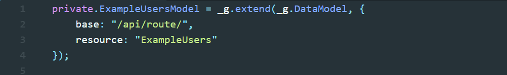
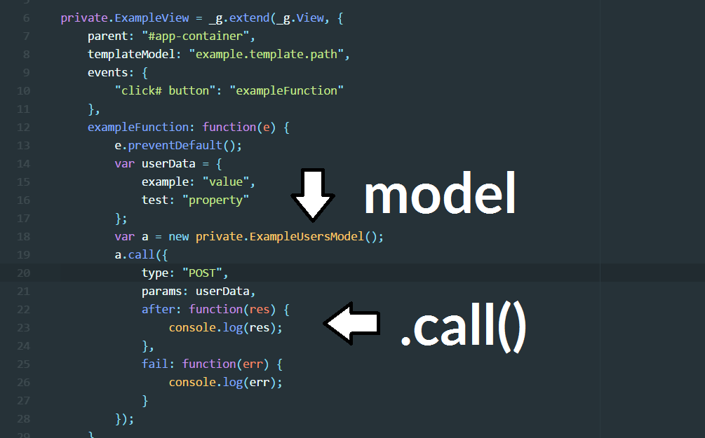
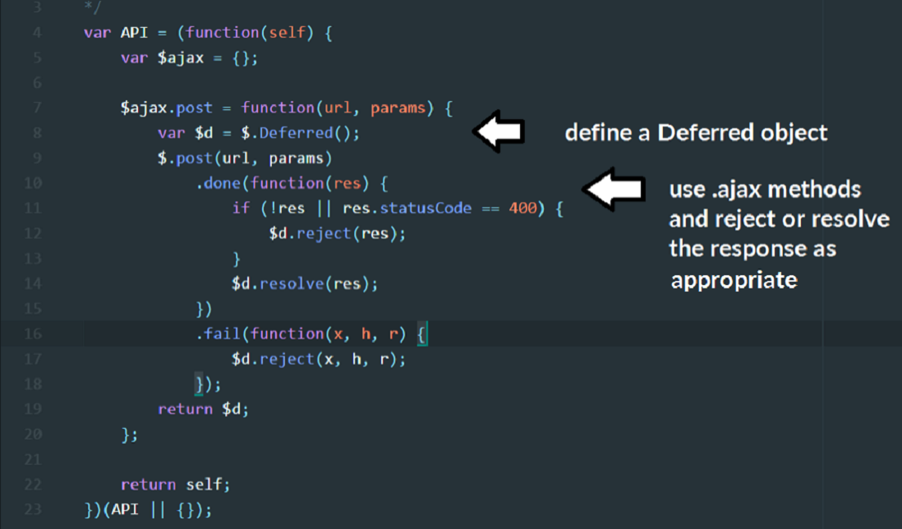
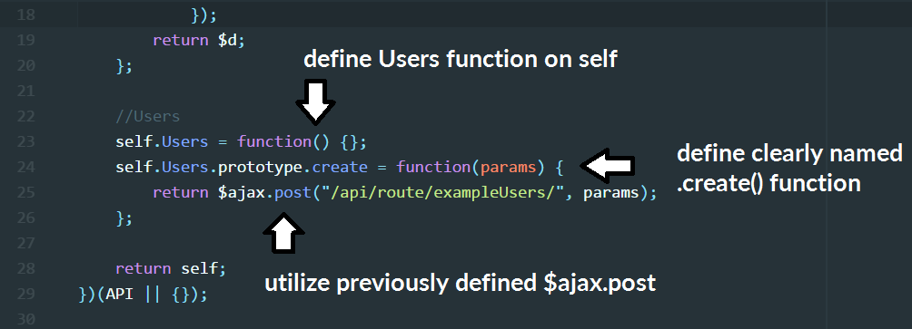
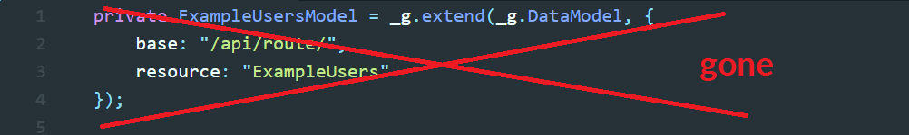
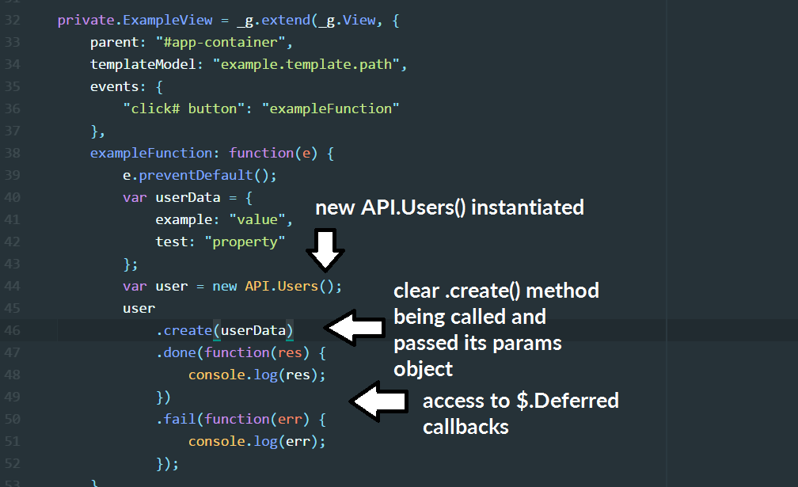
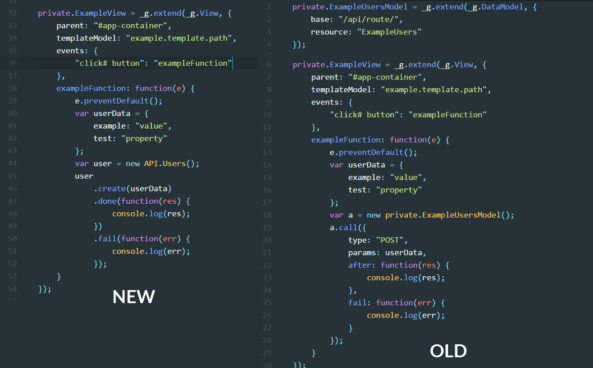
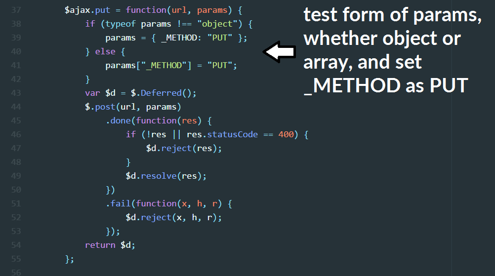
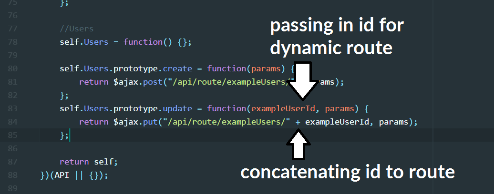
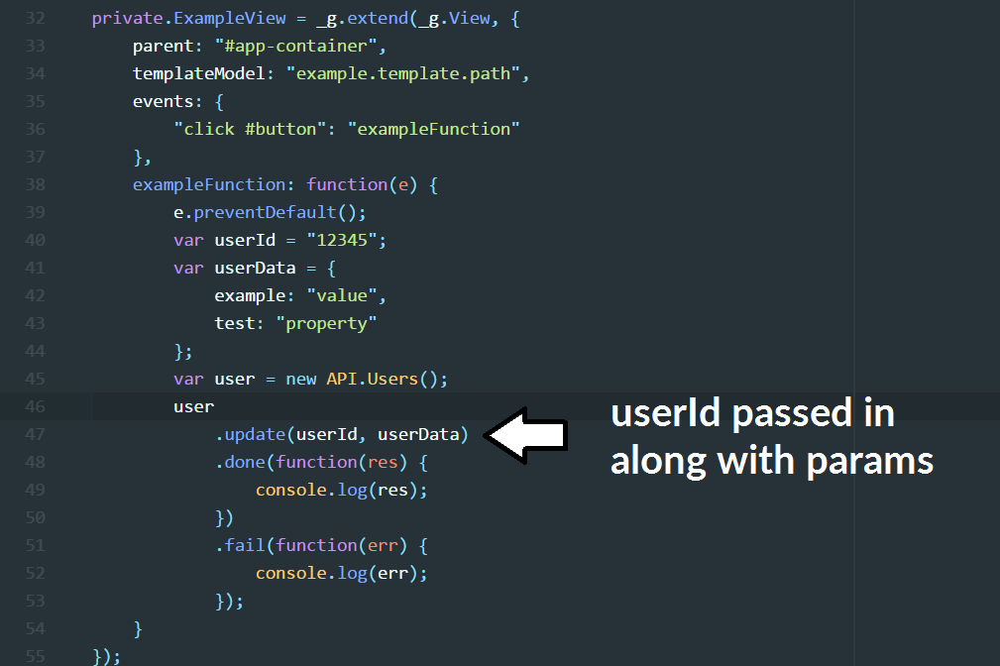

At my [current place of work](https://www.virtualjobshadow.com), we use a handrolled Javascript framework that most resembles [Backbone](http://backbonejs.org/). It has worked perfectly fine for us, but it had several nagging flaws. The new SDK wrapper is concise, readable, readily testable, easily documented, and centrally located.

Here is how we did it before, what we changed, and how it looks now. (Big thanks to [jfrisella](https://github.com/jfrisella) for leading this).

([git repo for those who want to look ahead](https://github.com/graysonhicks/demo-sdk))

### Previous API Calls

Here’s how we would do a basic post to one of our API endpoints.

Model with route for API defined in two parts.

For this example, we will be using ‘Users’ as the model, and show how it was done before the SDK. First (above), a model is defined, and requires an API route to be defined with it. In this case: `/api/route/ExampleUsers`. Next, one of our Views is instantiated (you can ignore, or have a look at how it’s done, it’s not the focus of this post). Inside one of the event callbacks `exampleFunction`, the model is instantiated and we use the native Javascript function `.call()` to hit the API. We tell it that it is a `POST`, pass in our params, and sometimes pass in additions to the url.

This is our basic pattern for API calls on the front-end, and overall it works perfectly fine. It has several main drawbacks that made it worth our while to rework.

1.  **Readability — **When working through a bug or updating a feature, determining what the `.call()` in the model is doing can take a minute to read through. The `type` on the `.call()` actually says a lot about the API call (whether it is create/update/get/delete), but when glancing at code, can be easy to misread. It would be nice if this was more semantic.
2.  **Verbose **— The model is defined in every View that it is used, and sometimes not clearly. So you may have to scroll up to double-check which API route is being used.
3.  **Dispersed** — We will centrally locate all API calls and routes, so if the route ever changes, it will just change once in the api.js file, instead of where every DataModel was instantiated
4.  **Documentation** — Not being centrally located makes finding, understanding and documenting each model a chore. The new API SDK will be housed in a single file that will be simply transformed to documentation
5.  **Testability** — Hand in hand with a dispersed, undocumented system, our goal of adding front-end tests to a code base without them looked daunting with the existing API structure. The new one provides a clear framework for testing

Notice that the point of this SDK is not necessarily saving lines of code (it did end up trimming a thousand something lines, but out of a very large code base). The primary objective was **clean and readable API calls**.

### The New API SDK

The heart of this API are the [jQuery](https://api.jquery.com/jQuery.Deferred/) `[deferred](https://api.jquery.com/jQuery.Deferred/)` [object](https://api.jquery.com/jQuery.Deferred/), and the `[$.ajax](http://api.jquery.com/jQuery.ajax/)` interface. We will define the API using an IIFE and return it out to the global scope. (This can be attached as a separate api.js file or bundled up with the rest of your code base using `module.exports`, which I won’t cover here). The basic pattern for this is similar to a jQuery plugin, shown [here](https://learn.jquery.com/plugins/basic-plugin-creation/).

Here is the basic layout for a `POST`, which we will be using to create our ‘User’.

The `.post()` will take the API route, as well as the params required (either an object or array), as its arguments.

Defining the `$ajax.post` method is not our end goal, as notice that the returned object is `self`. Next we will start attaching to the `self` object, and use this `post()` method to begin cleaning up our API calls.

To begin defining a section for our API, we will attach a new `Users` function to `self` and attach a `.create()` function to the prototype of the `Users` function as shown below.

Voila. Notice how the `.post()` here receives the API route required, and takes the params passed in the `.create()` method as it’s second argument.

Now we should have access to `new API.Users()` anywhere in our code. (This same pattern is repeated for our `PUT`, `GET`, and `DELETE` methods, which I will post at the end.)

Next, what does this look like when we actually make the call? Well, it looks really similar. A little cleaner in my opinion, but much more readable. Also, with this pattern we can skip instantiating the model in each View altogether:

Here’s the new call for creating a User in the View:

A little can go a long ways. Much clearer as to what is being done in `exampleFunction` and a few less lines of code as well. Now here is a side-by-side comparison of the new vs. old.

We will continue this basic pattern for building out all of our CRUD operations, but this `.create()` method only takes params. What if we want to have other methods on `User` that alter the url? It’s very simple to handle these dynamic routes with just a slight tweak to the same pattern.

### Dynamic API Routes

How do we approach the idea of having dynamic routes like `/api/route/exampleUsers/:exampleUserId`? This is commonly used on `PUT`s and `DELETE`s for targeting an individual record. Here’s an example in action:

Adding put to our API file

Now creating the `.update()` call with a dynamic route that relies on adding the userId to the url:

Lastly, here’s how we would make that call and pass in the userId on the front-end:

Same as .create() but with the userId passed.

Those two patterns, the `.create()` and `.update()` shown above should cover the vast majority of use cases. I will link to the github repo with the full examples.

### Conclusion

This process was one that had very satisfying benefits almost immediately.

1.  The API calls are much more readable both when they are called, and also in the central `api.js` file
2.  While not the focus, lots of code was trimmed, making it cleaner and easier to maintain in the future
3.  The bones for building out our new documentation and testing framework are all in place

In just a few short days, I had switched out all existing `.call()` instances and upgraded to the new API SDK. We are still adding to the API as needed, and it has been a very high impact project across several facets of our workflow. Features, tweaks, and bug fixes are all benefiting from the clarifications made.

I hope you enjoyed, [here](https://github.com/graysonhicks/demo-sdk) is a link to the completed files, with full CRUD examples (I’ve removed our View code as the calls should be usable inside any View framework). Thanks!