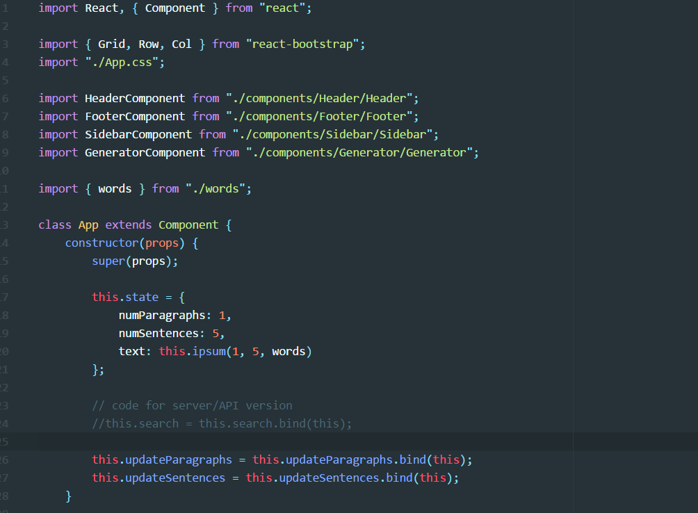
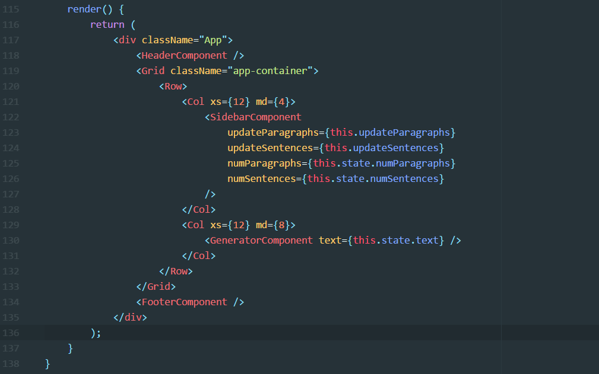
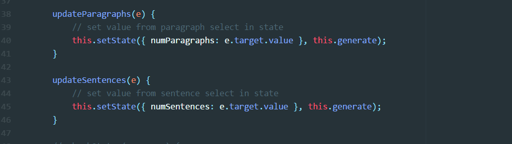
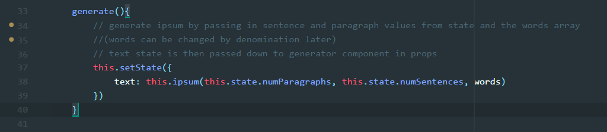
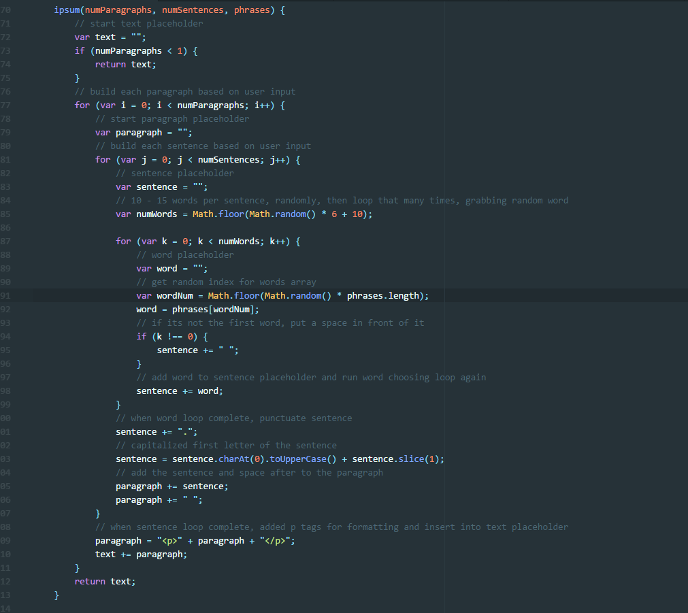
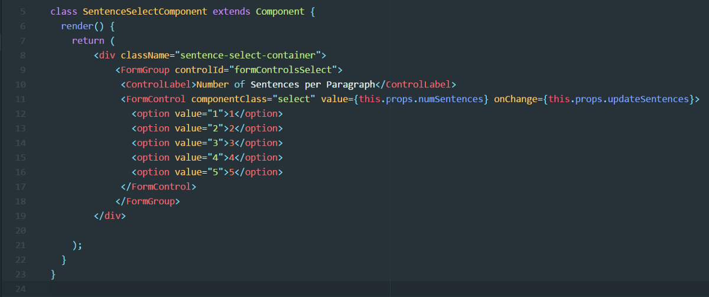

A while back, my friend [Benjamin Robertson](https://medium.com/@bgrobertson) put together an awesome lorem ipsum generator, called [Lorem of Zelda](http://loremofzelda.com/). (How this doesn’t have 10K stars on GitHub is beyond me 😆). Immediately, I added ‘lorem ipsum generator’ to my to-do list. Here’s a quick rundown of how I built this lorem ipsum generator, and a basic design pattern you can use to build your own React lorem ipsum generator.

I’ll go ahead and link to the site and the repo if you want to look ahead.

Site: [https://graysonhicks.github.io/sanctum-ipsum/](https://graysonhicks.github.io/sanctum-ipsum/)

Repo: [https://github.com/graysonhicks/sanctum-ipsum](https://github.com/graysonhicks/sanctum-ipsum)

St. James Cathedral, Toronto

### Getting Started

Fast forward a week or two later, I got around to it and decided to stay fresh on my React and node. The lorem ipsum generator was a great chance to do that. For theme inspiration, I had heard many in the [Catholic Creatives](http://www.catholiccreatives.org/) group looking for various Catholic-centric tools (CMS, stock photos, etc.), so I thought a Catholic themed lorem ipsum generator would be a fun fit.

I started with `create-react-app` because I love the default tooling it uses to get up and going fast. I used to spend a long while setting up the unique tooling for a React project. In no time, the scaffolding was up.

Let’s get straight into it.

### The State

I’ll go ahead and link to the [App.js of this project](https://github.com/graysonhicks/sanctum-ipsum/blob/master/client/src/App.js). I won’t be getting in to the nitty-gritty of how I set up the node server for this, but for this run through I’ll just walk through how I built it front-end only, without the server. The code is all there if you want to follow or dig deeper.

To begin, we will import React, some bootstrap, CSS, our components, and our dictionary of words. Keeping the dictionary in the separate [words.js](https://github.com/graysonhicks/sanctum-ipsum/blob/master/client/src/words.js) file keeps the App.js much cleaner. (In the node version, it is stored on the server).

Our state will include:

- the number of paragraphs needed
- the number of sentences per paragraph
- the generated ipsum text itself.

Our constructor will set these at some defaults to begin. Lastly, we will bind the functions that will be called by events in child components.

### The Render

I’ll jump straight to the `render()` here to show the design and how our initial state will be rendered. We’ve got a `SideBar`, where two methods are being passed down, as well as the `numParagraphs` and `numSentences`. Most of the heavy lifting is done through this component. We’ve got the `Generator` component, which just takes `text` from the state and displays it.

Now, let’s look at the methods that are being passed down in to the `SideBar`, before we go any further into it.

### The Methods

The two methods are nearly identical, `updateSentences` and `updateParagraphs`. They will take the value from a select option in the `SideBar` component, and set it into state.

These are straightforward enough. However, what they also do is use one of my favorite patterns in React, the `setState` callback ⚡️. This simply takes the second param of `setState` as a function to be called when that `setState` in complete. This is a totally wonderful way to help manage the state in small applications that don’t require a separate library for state management, like [Redux](http://redux.js.org/). It’s very powerful for handling the async nature of `setState`.

The method that is called in this callback is`generate`. What `generate` does is call `setState`, but it uses another method `ipsum` to return the desired string of text. Both the`ipsum` and `generate` methods are not bound in the constructor or passed down through props, only called in the App.js level.

The `ipsum` is really the heart of a lorem ipsum generator, and several different techniques for creating lorem ipsum type text can be found online. The basic pattern for this case though is loop in a loop in a loop! Here is the `generate` method, and the `ipsum` method that it uses in setting state.

generate method

The format of how you build your `ipsum` method can differ wildly, for example, if you are generating off of an array of sentences vs. words. (To see building with a dictionary of sentences in action, check out [Benjamin Robertson’s Lorem of Zelda code](https://github.com/benjamingrobertson/loremofzelda/blob/master/main.js)).

So now that we’ve seen the methods and how the text is generated and set in state, the `GeneratorComponent` receives it in props and updates. Here’s a quick look at the components.

### The Components

The main components are the `SideBar`, where the user inputs their choice for number of sentences and paragraphs, and `Generator`, which despite its name (😕) doesn’t generate anything, it displays the finished text.

#### The SideBar

The `Sidebar` is really a container component that passes the state to two selects that do the actual state updates.

Here’s a quick look.

#### The Selects

The select components are straightforward as well. They listen `onChange` for updating the state with their corresponding number of sentences/paragraphs.

They are identical besides the paragraph/sentence difference.

#### The Generator

Last, is the `Generator`. It’s so simple that I debated showing it, but did want to touch on one aspect of it. The `Generator` receives the string of HTML generated by the `ipsum` method, and renders it to the container. Because it is receiving HTML, and not plain text, it requires using the ominously named `dangerouslySetInnerHTML` React prop. The reason this is dangerous involves someone inserting a `\<script>` tag in to this, and doing nefarious things. In my case however, the user is not using a text input, the App instead is providing the string, using only their number input values from `selects`. I feel fine about using it in this case. Otherwise, you would use a lifecycle method like `componentDidUpdate`. So, here’s what it looks like:

### Wrapping Up

That should do it! Now we’ve got a nifty lorem ipsum generator full of Catholic words and phrases.

Link to the site again: [https://graysonhicks.github.io/sanctum-ipsum/](https://graysonhicks.github.io/sanctum-ipsum/)

Also, there is the API version, which looks something like this, if you are interested:

**GET**

`[https://sanctum-ipsum.herokuapp.com/api/:numberOfParagraphs/:sentencesPerParagraph](https://sanctum-ipsum.herokuapp.com/api/:numberOfParagraphs/:sentencesPerParagraph)`

Returns:

\{  
'ipsum': '\
Confession rosary Pope Francis Paschal mystery Ash Wednesday natural law Nicene creed saint medal Nicene creed canonization communion adoration catechesis.\
'  
}

I also published this as an npm package. Check it out [here](https://www.npmjs.com/package/sanctum-ipsum).

I hope this has been a helpful guide for creating a React lorem ipsum generator. The [github repo](https://github.com/graysonhicks/sanctum-ipsum) also contains the code and how-to for running the [server](https://github.com/graysonhicks/sanctum-ipsum/tree/server) build to return the ipsum text with node.js, instead of on the front-end with pure React.

Thanks for reading, feel free to reach out with questions or comments!
