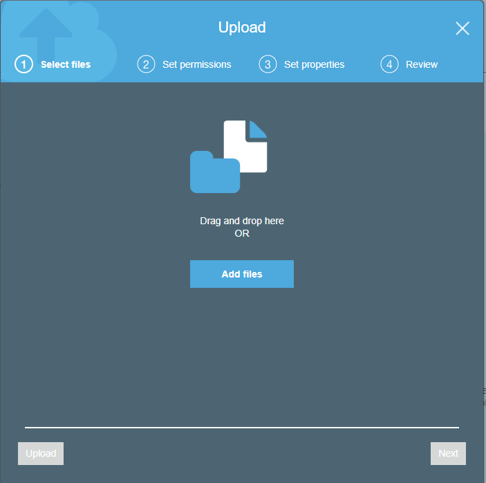
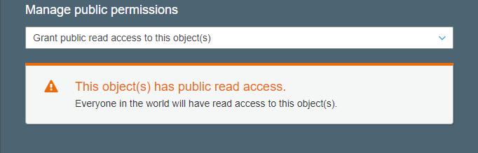
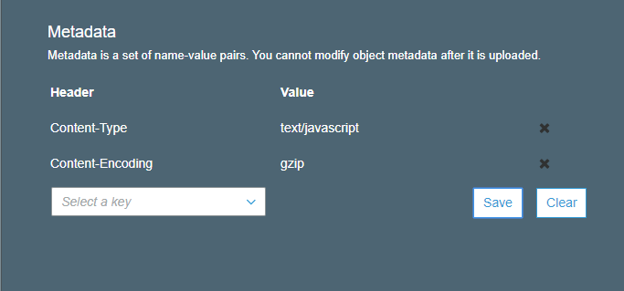

Amazon’s [S3](https://aws.amazon.com/s3/) service is go-to for many developers when they need cheap, powerful static hosting. S3 has been around for a while, and Amazon has done a good job keeping the interface up to date and easy to use. If you are looking to [gzip](http://www.gzip.org/) your static JS and CSS when hosting on S3, however, it’s not obvious how to do so, and results often bring up other AWS hosting services as well. Here’s the quick and simple way to serve gzipped JS and CSS from AWS S3.

#### Starting in the File System

Because S3 is no frills and very affordable, some basics like gzipping are a little more work that many default server configurations, which will gzip your files on the fly. In our case, S3 needs those files compressed before they are uploaded, it can’t do the actual gzipping for us. This is done with a simple command, which I recommend be added as a script to your build step, or your continuous integration process.

`gzip -9 /path/file.css`

or

`gzip -9 /path/file.js`

That’s it! ⚡️ The `-9` just denotes that we want the highest level of compression. Now we’ve got our gzipped files and need to upload to S3.

#### Uploading to S3

Go ahead and get to the upload panel of S3, and choose “Add files”. (⚠️You may have to remove the .gz ending from the compressed files before you upload.)

⚠️Only upload one type of file (CSS or JS) at a time, as that matters for our next step. Choose the files and click ‘Next’.

#### Setting Permissions and Metadata

Here you will choose the Permissions. Because these are being served to the user, be sure to give public read access to the files.

Click ‘Next’ again to go to the Properties screen. Here you will choose whatever encryption and storage class you are using. At the bottom is where we will want to make our changes, where it says ‘Metadata’.

First, we will set the `Content Type`. This will be either `text/css` or `text/javascript` depending on the file. Enter the value and hit ‘Save’. More importantly, this is where we tell S3 that our file has been gzipped. Choose the `Content Encoding` option (see, not so obvious). For the value here, enter `gzip`. Enter any other metadata fields you want for the file. Hit ‘Save’ and the the finished inputs should look like this:

#### Voila!

Click ‘Next’, review your settings on the confirmation screen, and click ‘Upload’. All done! 🎉 Your page should now work as before albeit much faster and slimmer. Hope this helps, comment with any questions!